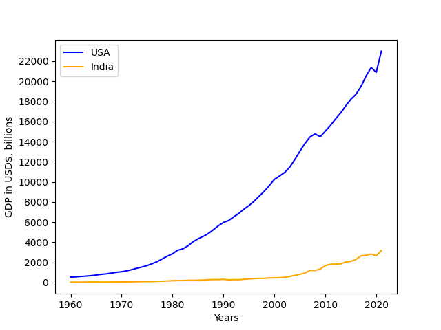
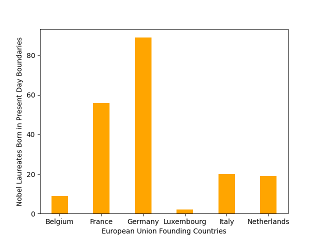

# Visualizing Interesting Datasets
For [project_02](https://github.com/mikeizbicki/cmc-csci040/tree/2022fall/project_02), I plotted two graphs *(one from two JSON datasets and another from one CSV dataset)* using python and MatPlotLib.

## US and Indian GDP figures from 1960 to 2021

This line graph plots the GDP figures, in billions of dollars, of both the United States and India from 1960 to 2021. It shows an increase in the GDP of both the US and India, with slight downturns during the two most recent recessions. The US is also shown to have a larger GDP, almost seven-fold, to that of India. The JSON datasets for both countries were retreived from [awesome-json-datasets](https://github.com/jdorfman/awesome-json-datasets#gdp).

## Number of Nobel Laureates Born in the Present Day Borders of Founding EU Countries from 1901-2016

This bar graph depicts the number of Nobel laureates, of any categorary, who were born within the present day borders of the six founding EU countries (Belgium, France, Germany, Luxembourh, Italy, and The Netherlands). Germany vastly outperforms many of the other founding nations, though a better graph would standardize this data according the # of laureates proportional to the population of each founding member. The CSV [data](https://dataverse.harvard.edu/dataset.xhtml?persistentId=doi:10.7910/DVN/AGAFAQ) was retrieved from a Harvard Dataverse dataset by Maryna Kuzmenko (2016).

## Bibliography
Kuzmenko, Maryna, 2016, "Nobel Prize - Dataset with Information about Prizes, Laureates and Countries", https://doi.org/10.7910/DVN/AGAFAQ, Harvard Dataverse, V1, UNF:6:McdDh+ldUTGgZDs5XVOQUA== [fileUNF]